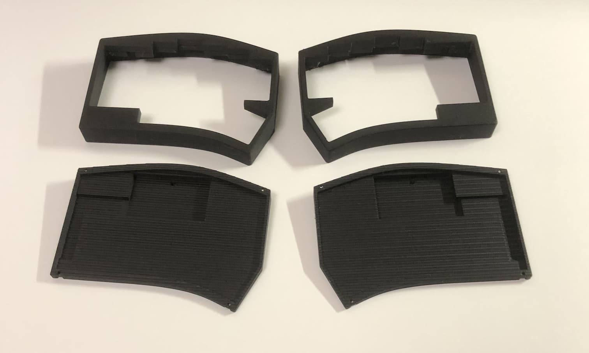
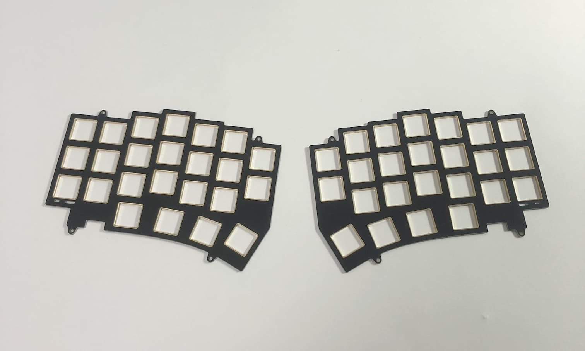
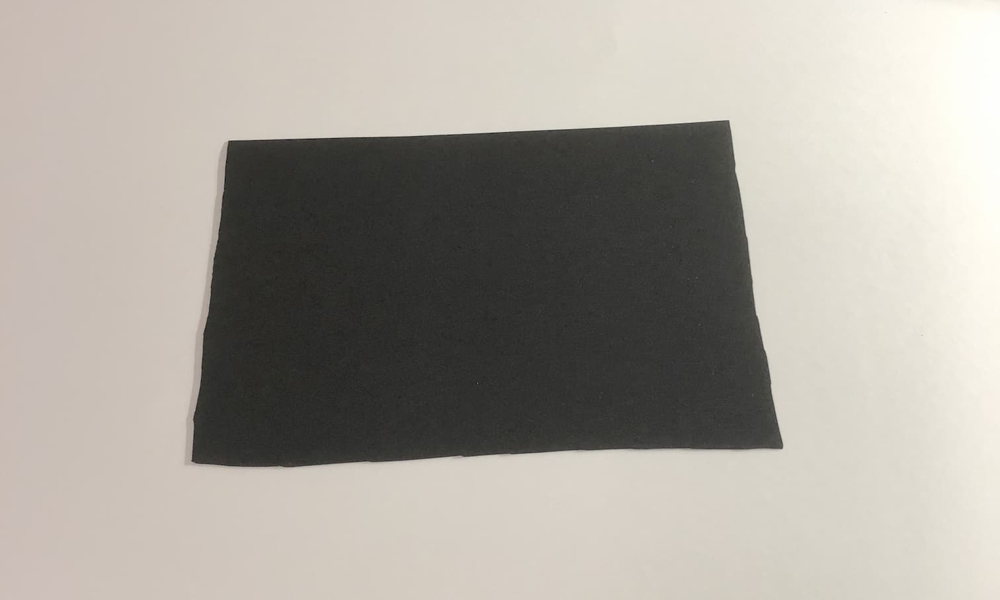
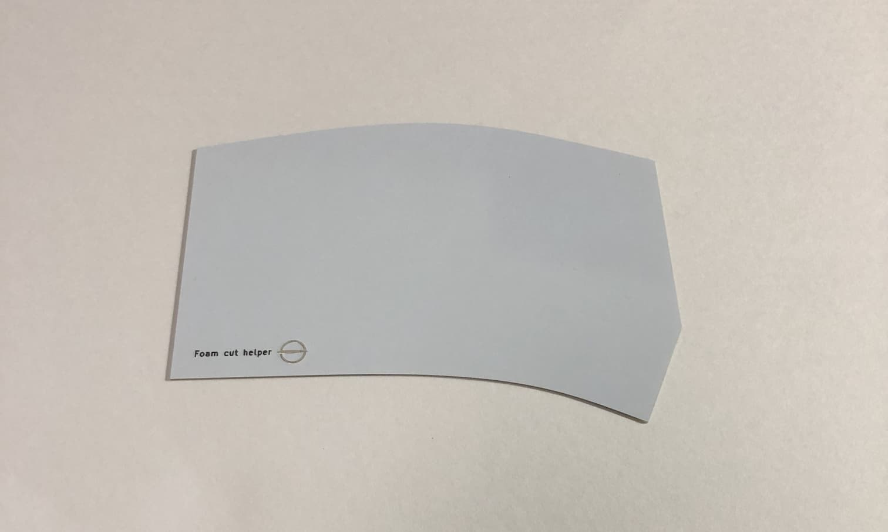
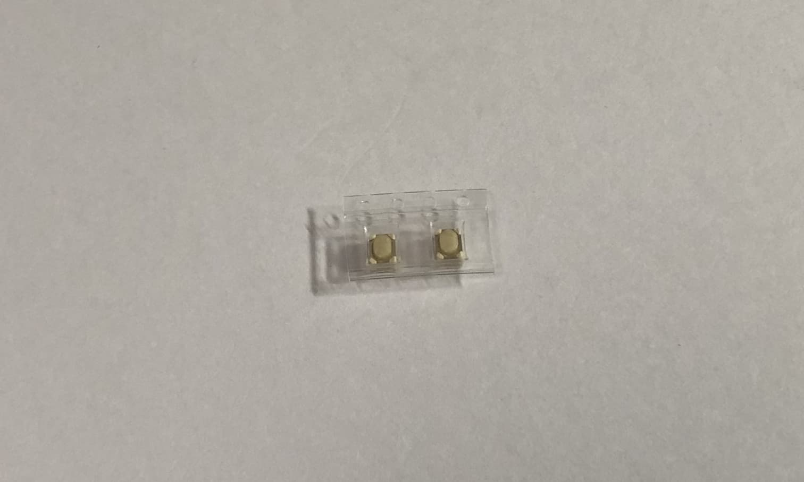
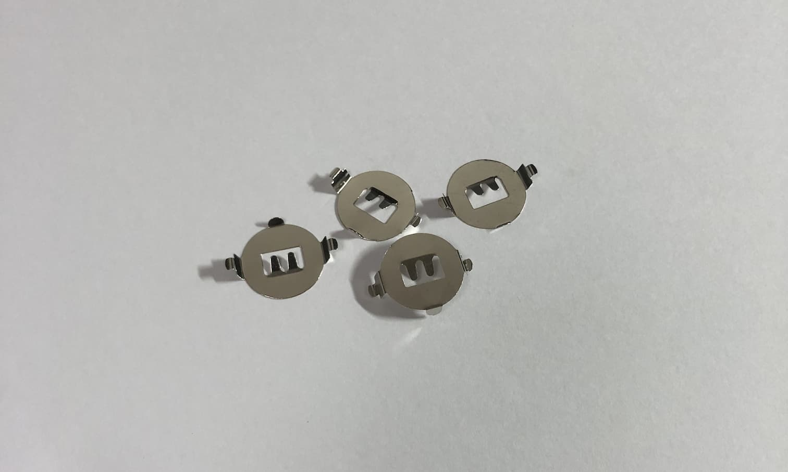
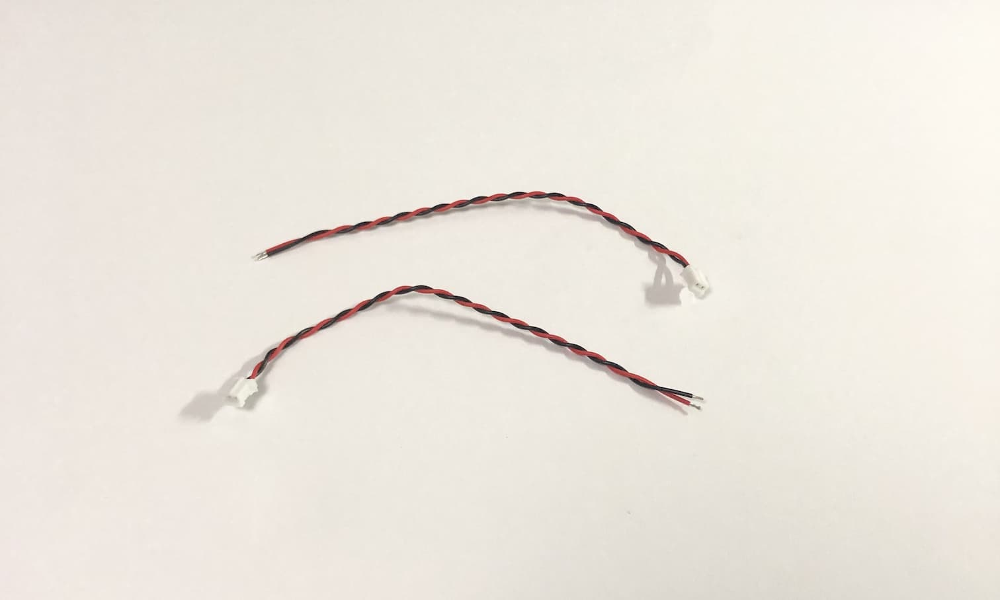

# Caravelle-BLE ビルドガイド
自作キーボードキット[Caravelle-BLE](https://satt.booth.pm/items/1644450)のビルドガイドです。  
組み立ての際は、本ビルドガイドの最後まで目を通した上で作業をはじめることを推奨します。

## 準備
最初に必要な部品および工具があることを確認します。
### 同梱品の確認
|部品|個数|
|---|---|
|トップケース|左右1個ずつ|
|ボトムケース|左右1個ずつ|
|プレート|左右1枚ずつ|
|M2×4mmねじ|18個|
|1.5mm六角レンチ|1個|
|M2インサート|19個|
|インサート練習用ブロック|1個|
|1.5mm六角レンチ|1個|
|滑り止め|8個|
|消音フォーム|1枚|
|フォームカットヘルパー|1枚|
|本体基板|左右1枚ずつ|
|タクトスイッチ|2個|
|スライドスイッチ|2個|
|PHコネクタ|2個|
|電池用基板|2枚|
|ボタン電池ホルダー|4個| 
|ショットキーバリアダイオード|4個| 
|コンデンサ|2個| 
|PHコネクタ付きケーブル|2個| 

|  |   |  |  |
| ---- | ---- | ---- | ---- |
| ケース | プレート | ねじ | 六角レンチ |
|  |   |  |  |
| インサート | インサート練習用ブロック | 滑り止め | 消音フォーム |
|  |   |  |  |
| フォームカットヘルパー | 本体基板 | タクトスイッチ | スライドスイッチ |
|  |   |  |  |
| PHコネクタ | 電池用基板 | ボタン電池ホルダー | ショットキーバリアダイオード |
|  |  |  |  |
| コンデンサ | PHコネクタ付きケーブル |  |  | 

### 追加で用意する部品
|部品|個数|
|---|---|
|ボタン電池(CR2032)|4個|
|MX互換スイッチ|48|
|MX用キーキャップ|1u 42個、1.25u 4個、1.5u 2個|

### 工具
組み立てには電子工作に使用する工具が一通り必要です。下記のページなどを参考に工具を用意しましょう。
- [Helix キーボードキットの製作に必要な工具メモ | gist.github.com](https://gist.github.com/mtei/6957107a676ddfa85bde0ae41f8fa849)
- [第8回「自作キーボードのつくりかた #2」組み立てる道具とはんだ付け編 | Youtube](https://youtu.be/LOC53FeU-QM)
- [自作キーボードを作るために必要なもの | 自作キーボード温泉街の歩き方](https://salicylic-acid3.hatenablog.com/entry/2018/11/24/%E8%87%AA%E4%BD%9C%E3%82%AD%E3%83%BC%E3%83%9C%E3%83%BC%E3%83%89%E3%82%92%E4%BD%9C%E3%82%8B%E3%81%9F%E3%82%81%E3%81%AB%E5%BF%85%E8%A6%81%E3%81%AA%E3%82%82%E3%81%AE#%E8%87%AA%E4%BD%9C%E3%82%AD%E3%83%BC%E3%83%9C%E3%83%BC%E3%83%89%E3%81%A7%E5%BF%85%E8%A6%81%E3%81%AA%E3%82%82%E3%81%AE)
- [自作キーボードの組み立てに使っている工具 | yfuku blog](https://blog.yfuku.com/entry/keybord_build_tool)

なおインサートをケースに熱圧入する都合上、はんだごては温度調整機能がついているもの（HAKKO FX600等）が必須です。

## 組み立て
### 概要
次の順番でキットを組み立てていきます。
- 電池用基板を組み立てる
- 本体基板を組み立てる
- 本体基板の動作確認
- 本体基板にスイッチを取り付ける
- ケースを組み立てる

### 電池用基板に部品を組み立てる
はじめに電池用基板を組み立てます。  

1. ボタン電池ホルダー×2を取り付ける
    * ホルダーの片脚をペンチでまっすぐ伸ばす
    * 電池を入れる側（小さいでっぱりと反対側）が基板の角を向くようにホルダーの両脚を基板に挿す
    * まっすぐにした脚を再び折り曲げ、基板と平行にする
    * ホルダーの脚を基板にはんだ付けする
    * もう片方のホルダーも同様の手順で取り付ける

1. ダイオード×2を取り付ける
    * 片側のパッドに予備はんだを盛る
    * ダイオードの向きに注意しつつ、予備はんだをつけたパッドにダイオードをはんだ付けする（基板の`コ`の字型のシルクの縦線とダイオードの印字の縦線を揃える）
    * もう片側のパッドもはんだ付けする

1. コンデンサを取り付ける
    * 片側のパッドに予備はんだを盛る
    * 予備はんだをつけたパッドにコンデンサをはんだ付けする
    * もう片側のパッドもはんだ付けする

1. コネクタ付きケーブルを基板の左側のスルーホールに取り付ける
    * 赤いケーブルをVCCにはんだ付けする
    * 黒いケーブルをGNDにはんだ付けする

1. ボタン電池を入れ、テスターで電圧を確認する
    * 正しく組み立てられていれば、VCCとGNDの間で2.5Vほどが測定される

1. 2個目の電池用基板も1個目と同様の手順で部品を取り付けます。
    * ただし、ケーブルは1個目と逆で右側のスルーホールに取り付けます。

### 本体基板を組み立てる
次に本体基板を組み立てます。

1. タクトスイッチを取り付ける
    * 右側2つのパッドに予備はんだを盛る
    * 予備はんだをつけたパッドにタクトスイッチをはんだ付けする
    * 左側2つのパッドもはんだ付けする

1. スライドスイッチを取り付ける
    * ずれやすいのでマスキングテープ等で固定した上ではんだづけする

1. PHコネクタを取り付ける
    * こちらもマスキングテープ等で固定した上ではんだづけする

1. もう片側の本体基板も同様に組み立てる

### 本体基板の動作確認
スイッチを取り付ける前に本体基板が正しく動作することを確認します。なおキットでは、事前にデフォルトのファームウェアが書き込まれています。

1. スレーブ側（右手側）を起動する
    * 電池基板のケーブルをスレーブ側の本体基板のコネクタにはめる
    * スライドスイッチの端子をON側（右側）にスライドする
    * パソコン等の端末からBluetoothデバイスのスキャンを実行する
    * デバイス一覧に`Nordic UART`と表示されることを確認する
    * スレーブ側が起動しない場合は、電池基板と本体基板のはんだづけが正しく行われていることを再度確認する

1. マスタ側（左手側）を起動する
    * スレーブ側と同様の手順でマスタ側を起動する
    * マスタとスレーブのペアリングが自動的に実行される
    * 端末からBluetoothデバイスのスキャンを再度実行
    * デバイス一覧から`Nordic UART`という表示が消え、代わりに`Caravelle-BLE`が表示されることを確認後、ペアリングを実行（これ以降、スレーブ側のみを起動したとしても`Nordic UART`はデバイス一覧に表示されない）
    * マスタ側が起動しない場合は、電池基板と本体基板のはんだづけが正しく行われていることを再度確認する

1. 入力テストを行う
    * ピンセット等で各キーのスルーホールをショートさせて文字が入力されることを確認する
    * [EK Switch Hitter](https://www.majorgeeks.com/files/details/switch_hitter.html)や[KeyboardTester.com](https://www.keyboardtester.com/)を使用するとどのキーが押されたか簡単に確認できる
    * デフォルトのファームウェアではキーボード側がUS配列である点や、スマートフォンなどでは反応がないキーコードもある点に注意

1. DFUボタンの動作確認を行う
    * 一度マスタ、スレーブの両方の電源を切る
    * タクトスイッチを押しながらスライドスイッチを操作してマスタ側を起動する
    * 端末からBluetoothデバイスのスキャンを実行し、`DFU Targ`（DFUモードで起動したキーボード）が表示されることを確認
    * タクトスイッチを押しながら起動してもDFUモードに突入しない場合は、タクトスイッチのはんだづけが正しく行われていることを再度確認する
    * スレーブ側も同様にDFUボタンの動作確認をする

### 本体基板にスイッチを取り付ける

動作確認が完了したら本体基板にスイッチを取り付けます。

1. スイッチをプレートにはめる

1. スイッチをはめたプレートを本体基板にはめる
    * スイッチのピンが折れていないか注意して確認する
    * スライドスイッチのスライド部分がプレートの切り込みに合っていることを確認します。スライド部分が干渉してプレートが上手くはまらない場合は、スライドスイッチのはんだ付けを修正します。

1. スイッチをはんだ付けする

### ケースを組み立てる

最後にケースを組み立てます。

1. ケースにインサートを熱圧入する
    * ケースの素材は60度ほどで軟化、200度ほどで融解するため、温度調整が可能なはんだごてを使用して作業する必要があります。
    * 最初に練習用ブロックを使用してインサートの熱圧入の練習をします。
    * はんだごての温度を230度ほどに設定します。
    * ピンセットでインサートを穴の上にのせ、軽い力ではんだごてを当て、インサートの温度上昇に合わせてゆっくりとインサートを穴に押し込みます。（注：無理に力を入れて押し込むと、穴が崩れたり、インサートが傾いて挿入されることがあります。）
    * 一回で最後まで押し込むのではなくインサートの位置を確認しつつ何度かに分けて押し込んでいくと失敗しにくいです。（押し込み量が足りない場合は修正が簡単ですが、押し込みすぎた場合は修正が比較的大変なため。）
    * インサートのフランジと穴周辺との段差がなくなるまで押し込んだら熱圧入完了です。
    * トップケース（片側8箇所）、ボトムケース（片側1箇所）にインサートを熱圧入します。

1. 消音フォームを切り出す
    * フォームカットヘルパーの外周にそって消音フォームを2枚切り出します
    * 柔らかい素材のため、カッターで罫書き線を入れ、ハサミで切り出すという方式が簡単です

1. トップケースにプレートを取り付ける。
    * 電池基板のケーブルが本体基板に取り付けられていることを確認します。
    * プレートをトップケースに載せ、六角レンチを使用してねじでとめます（片側4箇所）。（注：無理に力を入れてねじを回すとインサートが外れてしまうことがあるため、軽い抵抗を感じる時点でねじを回すのを止めましょう。）

1. ボトムケースに電池基板を取り付ける。
    * 電池基板をボトムケースに載せ、六角レンチを使用してねじでとめます（片側1箇所）。

1. トップケースにボトムケースを取り付ける
    * 溝に沿ってケーブルをはわせた上で、ボトムケースに消音フォームをのせる
    * ケーブルと消音フォームの位置がずれないように注意しつつ、ボトムケースにトップケースをはめ、六角レンチを使用してねじでとめます（片側4箇所）

1. 組み立て完了です！

## ファームウェア書き込み
BLEに対応するため、ファームウェアにはSekigonn氏の[nrf52対応のqmk_firmware](https://github.com/sekigon-gonnoc/qmk_firmware/tree/nrf52)を使用します。以下はSekigonn氏のSISO59ビルドガイドより引用。

1. リポジトリを取得する  
  nrf52対応のqmk_firmwareは[こちら](https://github.com/sekigon-gonnoc/qmk_firmware/tree/nrf52)

	- 既にqmk_firmwareを使っていて別のブランチとして用意したい場合
	```
        git remote add sekigon https://github.com/sekigon-gonnoc/qmk_firmware.git
        git fetch sekigon
        git checkout -b nrf52 sekigon/nrf52
	```
	
	- 既にqmk_firmwareを使っていて別のフォルダに置きたい場合
	  
	 ```
		git clone  -b nrf52 https://github.com/sekigon-gonnoc/qmk_firmware.git ble_micro_pro
	 ```
	  
	- 初めて使う場合
	
	```
        git clone --depth 1 -b nrf52 https://github.com/sekigon-gonnoc/qmk_firmware.git
	```

1. 必要サブモジュールを用意

		make git-submodule

1. NRFSDK v12.3.0を取得し、適当なディレクトリに展開する

	* BLE Micro Pro用とはバージョンが異なります。バージョン番号は厳守してください。

1. 展開したディレクトリをmsys2などビルド環境の環境変数に設定する

    ```
    export NRFSDK12_ROOT=<path to sdk> #例 /c/dev/nRF5_SDK_12.3.0_d7731ad
    ```    
    
### nrfutilのセットアップ(Windows(MSYS2))
[nrfutil.exe](https://github.com/NordicSemiconductor/pc-nrfutil/releases)をダウンロードし、~/qmk_utilに保存します。

### nrfutilのセットアップ(Mac, Linux)
pipでnrfutilを入れます。(python2.7)

```
pip install nrfutil
```

### 本体へのファームウェア書き込み
1. マスタ(デフォルトは左手・スレーブ(右手)それぞれのファームウェアをビルドする

    ```
    make caravelle_ble/master:default:dfu_ble
    make caravelle_ble/slave:default:dfu_ble
    ```

1. 完成したzipファイルをスマートフォンに移動、あるいは共有フォルダに移動する

1. スマートフォン・タブレットに[nRF Toolbox](https://play.google.com/store/apps/details?id=no.nordicsemi.android.nrftoolbox&hl=ja)をインストール(現時点ではPC版からは書き込めないようです。)

1. 書き込みたい基板の電源をタクトスイッチを押しながら入れる

1. nRF ToolboxでDFUを選択し起動

1. SELECT FILEから先ほど用意したzipファイルを選択

1. SELECT DEVICEで**DFU Targ**を選択

1. UPLOADを押し、書き込みを開始

## トラブルシューティング
### ペアリングが出来ない・出来なくなった

端末とマスタのペアリング情報を削除してから再ペアリングを実行してみてください。
 - 特定のペアリング情報を削除するにはDEL_IDxをキーマップに割り当てて実行してください。
 - スレーブも含む全てのペアリングを削除するには最上段の中心3つのキー（デフォルトの配列では`WER`に相当）を押しながら電源を起動してください。スレーブ側も同様の手順（`UIO`を押しながら起動）で削除できます。

## 使用上の注意
- 長時間使用しない場合やキーボードを持ち運ぶ場合は電池の消耗を防ぐため、電源を切ってください。
- 正常な動作中に電池が発熱することはありません。発熱を感じた場合はただちに使用を中止してください。

## 参考文献
本ビルドガイドは下記を参考に執筆しました。
- nrtkbb氏 [uzu42ビルドガイド](https://github.com/nrtkbb/Keyboards/blob/master/uzu42/build_guide_jp.md)
- Sekigon氏 [SISO59 ビルドガイド](https://github.com/sekigon-gonnoc/SISO59-doc/blob/master/README.md)  
- yfuku氏 [Claw44ビルドガイド](https://blog.yfuku.com/entry/craw44_buildguide)
